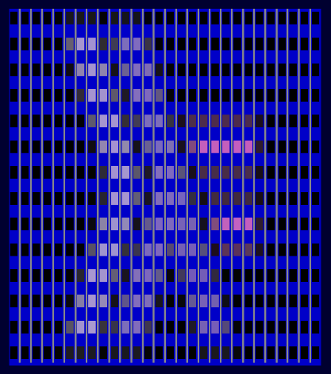

# Project Lighthouse Client for Haskell

[](https://github.com/fwcd/project-lighthouse-haskell/actions/workflows/build.yml)
[](https://fwcd.github.io/project-lighthouse-haskell)

An API client for a light installation at the University of Kiel written in Haskell.



## Running the Demo

To run the demo, first set the following environment variables

```bash
export LIGHTHOUSE_USERNAME=[your username]
export LIGHTHOUSE_TOKEN=[your API token]
```

> For this, you need a valid login at [lighthouse.uni-kiel.de](https://lighthouse.uni-kiel.de).

You can now render a demo image to the lighthouse by running

```bash
stack run -- lighthouse-demo/assets/haskell-icon-lighthouse.png
```
